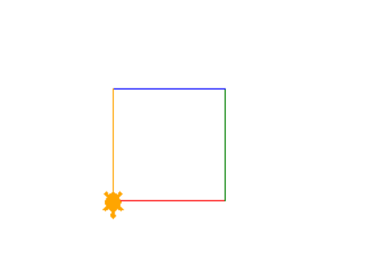

# Python course

## Chapter 1

The computer says 'hello world' and draws some shapes.

## Chapter 2

We can ask the computer to draw us a different sized square every time we launch the program.

We also go over how if statements work

